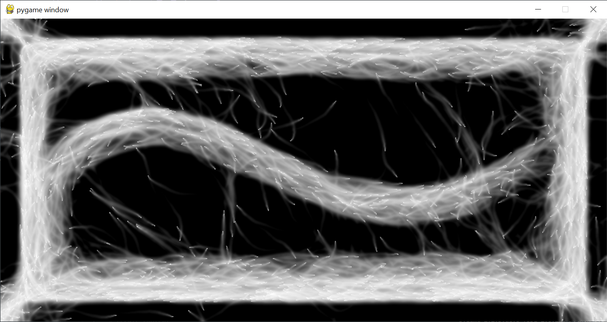
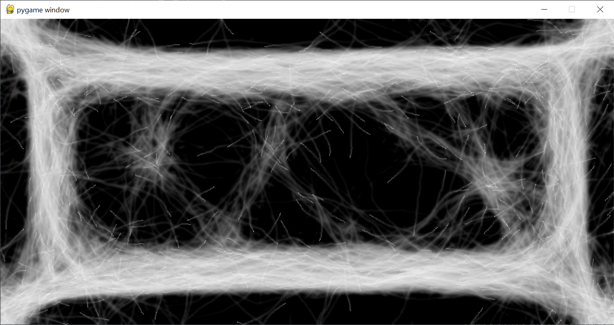
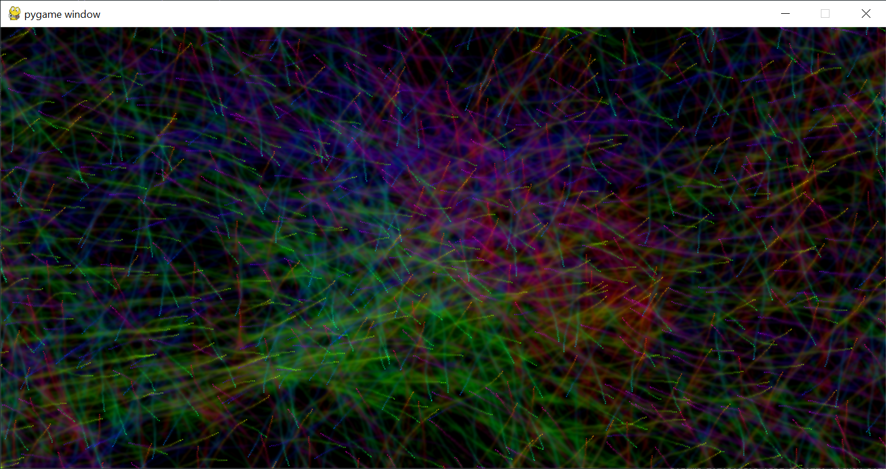
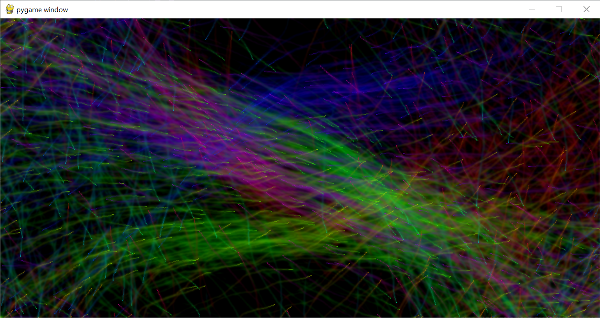
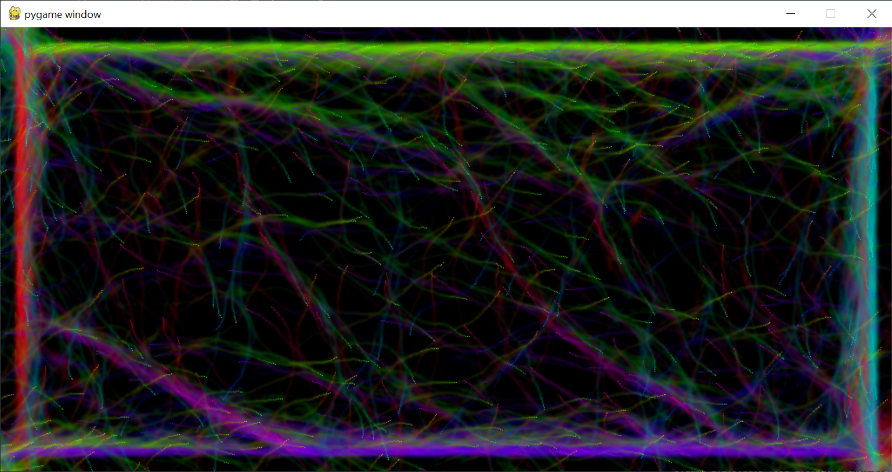
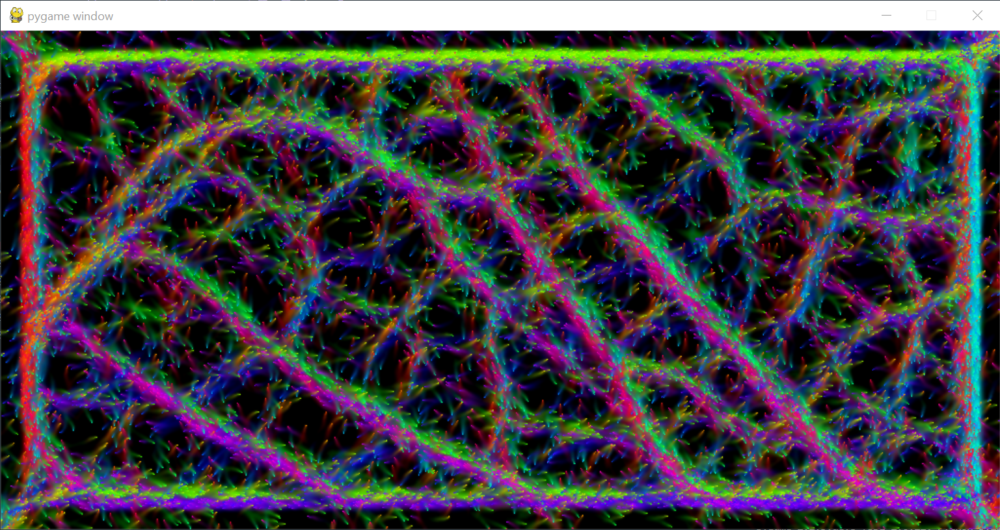

# 2D Particle Simulation: Space Traffic

## https://youtu.be/O-JVuuiDYMk

The simulation started with just black and white...
## 
With varying parameters came different phenomenons...
## 
Then came color based on traveling direction (i.e. radian angle)...
## 
Varying hyperparameters made new patterns...
## 
More distilled parameters were closer to the final shape...
## 
The final look, simulating 2^27 particles at 60fps...
## 

* *Name and partners name*
    * Caspar Grevelhoerster
* *How many hours did it take you to complete this final project?*
    * This project took about 60 hours to completion.
* *Did you collaborate or share ideas with any other students/TAs/Professors?*
    * No.
* *Did you use any external resources?*
    * https://github.com/SebLague/Slime-Simulation/blob/main/Assets/Scripts/Slime/SlimeSim.compute
    * https://www.youtube.com/watch?v=eJDIsFJN4OQ
    * https://lisyarus.github.io/blog/graphics/2022/04/21/compute-blur.html
    * https://github.com/moderngl/moderngl/tree/master/examples
    * https://uwe-repository.worktribe.com/output/980579
* *What was the most interesting part of the Final Assignment? How could the instructor improve the final project?*
    * The most challenging and interesting part of the project was figuring everything out by myself and moving all computations to compute shaders. This was especially hard because ModernGL is a relatively sparsely covered python package and there are only very few examples of implementations online. I would have wished for more office hours per week though in the end, I did not really need them.